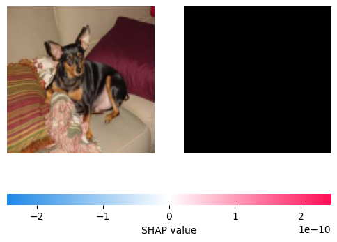

# [CUDO] Cats vs. Dogs Classification with SHAP Explainability

This project demonstrates a convolutional neural network (CNN) trained to classify images of cats and dogs, using SHAP (SHapley Additive exPlanations) for explainability. SHAP provides insights into the predictions by highlighting the regions of the image that contribute most to the model's decisions.

---

## Project Structure

### Dataset
The dataset is organized as follows:
```
cats-and-dogs/
├── train/
│   ├── cat/
│   │   ├── cat1.jpg
│   │   ├── cat2.jpg
│   └── dog/
│       ├── dog1.jpg
│       ├── dog2.jpg
├── val/
    ├── cat/
    │   ├── cat1.jpg
    │   ├── cat2.jpg
    └── dog/
        ├── dog1.jpg
        ├── dog2.jpg
```

- **train/**: Training dataset.
- **val/**: Validation dataset.

### Code Workflow
1. **Data Loading and Preprocessing**:
    - Images are resized to `(128, 128)`.
    - Data augmentation is applied using `ImageDataGenerator`.

2. **Model**:
    - A CNN with three convolutional layers and two fully connected layers.
    - Trained for 10 epochs with a batch size of 32.

3. **Explainability**:
    - SHAP is used to explain the model’s predictions for a subset of the validation data.
    - Feature importance is visualized for individual images.

---

## Requirements

Install the required Python libraries:

```bash
pip install tensorflow matplotlib scikit-image shap
```

---

## How to Run

1. **Prepare the Dataset**:
   - Place the dataset in the `cats-and-dogs` directory as shown above.

2. **Train the Model**:
   Run the script to train the CNN model:
   ```bash
   python cats_vs_dogs_classification.py
   ```

3. **Explain Predictions**:
   - SHAP explanations for the first 5 validation samples will be displayed after training.

---

## Results

### Training Performance
- The script plots training and validation accuracy/loss over epochs.

### Explainability
- SHAP visualizes the regions of images that contribute most to the predictions.

Example SHAP output:


---

## File Descriptions

- `cats_vs_dogs_classification.py`: The main Python script for training and explainability.
- `README.md`: Project documentation (this file).

---

## Future Improvements

1. **Transfer Learning**:
   - Use pre-trained models like VGG16 or ResNet for improved performance.

2. **Additional Explainability Methods**:
   - Incorporate LIME for comparison with SHAP.

3. **Overlay Visualizations**:
   - Overlay SHAP explanations directly on the images for better interpretability.

---

## License
This project is licensed under the MIT License.
